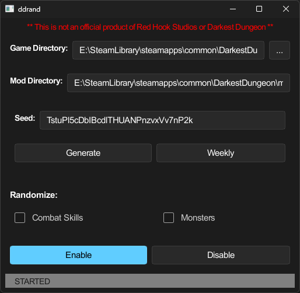
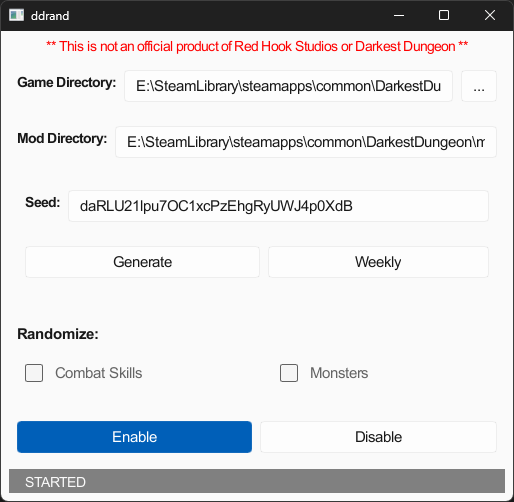

# ddrand

**This is not an official product of Red Hook Studios or Darkest Dungeon**

This application generates a randomizer mod for [Darkest Dungeon](https://www.darkestdungeon.com/) by Red Hook Studios.

The following are included as options for randomization:

- Hero combat skills, including official DLC heroes if present
- Hallway and room spawns in Cove, Ruins, Warrens, and Weald

## Table Of Contents
- [ddrand](#ddrand)
  - [Table Of Contents](#table-of-contents)
  - [Installation](#installation)
    - [Windows](#windows)
    - [Source](#source)
  - [Usage](#usage)
  - [Compatibility](#compatibility)
  - [Limitations](#limitations)
  - [Known Issues](#known-issues)
  - [Contributing](#contributing)
  - [AI Policy](#ai-policy)
  - [Version Policy](#version-policy)
  - [License](#license)

## Installation

### Windows

Download the appropriate release file, and extract the executable file to any location and run it either 
by double clicking the icon or from the command line.

### Source

**Requirements:** Rust 1.78 or newer

After obtaining the `ddrand` source archive or cloning the [repository](https://github.com/melocene/ddrand), change into the directory and run:

```
> cargo install --path .
```

## Usage




Run the application, select the options you would like to randomize and click the `Enable` button to generate and install the mod.

Directory fields are provided for informational purposes and cannot be directly edited. Using the `...` button will allow for 
choosing a need installation directory if not automatically detected. From the installation directory the mod directory itself 
will be automatically calculated.

The `Generate` button will generate a random seed, and the `Weekly` button will generate a seed from the current year and week.
This is to facilitate races or other community challenges using a consistent seed. If the mod is already installed clicking `Enable` 
will prompt to overwrite the existing installed version. The `Disable` button will uninstall the mod after a prompt for confirmation.

Once the application is complete, simply start Darkest Dungeon and select `ddrand` from the mod list for your save. To recover the 
running seed a `seed.txt` file can be found in the mod installation directory. This file can be also used with OBS to 
display it on screen, or via a bot command, when streaming the game for viewer reference.

A log file will be written to the directory `ddrand` was run from. In the event of an issue starting `ddrand` from the command line 
with with the `-d` or `--debug` options will log additional information. Compiling the application in debug mode will also enable 
debug logging without needing the additional flag.

## Compatibility

Any mod(s) which alters the default heroes and/or their skills, including DLC, are **not** compatible with the 
randomizer mod generated by this application.

The generated mod is known to work on at least **stable** build 25559 of Darkest Dungeon. The build can be found on 
the game's main menu in the top left corner of the screen. While older builds may work, they will not be tested.

## Limitations

- Only the **Steam** version of the game on **Windows** is currently supported, all other releases do not provide 
the appropriate tooling for exporting localization data.
- DLC characters will be included as long as the DLC is installed. Disabling the content 
for a save game will not automatically exclude them if the randomizer mod is active.
- Saving and quitting during a battle will not reset the spawn if a new randomizer mod is generated.

## Known Issues

[Known issues](https://github.com/melocene/ddrand/issues) for this application are listed and searchable on GitHub.

Due to a bug in the `Slint` GUI framework command line flags will not display, but will work as expected ([Ref](https://github.com/slint-ui/slint/issues/3235)). 

## Contributing

Ensure all contributions do not violate intellectual property or copyright laws, and under no circumstance should 
any official game data or files be uploaded to this repository or included in any source code.

Otherwise, all contributions are welcome and encouraged. Not a Rust developer? No problem, contributions 
can include bug reports or updated documentation as an example.

For details specific to code contributions please see the [contribution guidelines](CONTRIBUTING.md).

## AI Policy

This project is, and should remain, written primarily by humans for humans. Regardless of development workflow used a human will review all submissions before they can or will be merged.

However, generative AI is fast becoming a first-party feature in most development environments, including GitHub itself. If you use Generative AI to write the vast majority of your submission (e.g., agent-based or vibe coding) then you must document your use of AI in your pull request. Please include the service you used and/or model that generated the code. Ensure any AI usage adheres to any license or other restrictions which may apply.

Undisclosed AI usage may result in code contirbutions being removed or the banning of a developer from contributing to this project.

## Version Policy

This project adheres to [Semantic Versioning](https://semver.org).

All notable changes to this project can be found in the [changelog](CHANGELOG.md).

## License

Copyright (c) 2024-2026 [ddrand developers](https://github.com/melocene/ddrand/)

`ddrand` is released under the GPLv3 license.

See the [LICENSE](LICENSE) file for full license details.

All game assets outside of this application are excluded from this license, 
and are copyright of [Red Hook Studios](https://www.redhookgames.com/).
